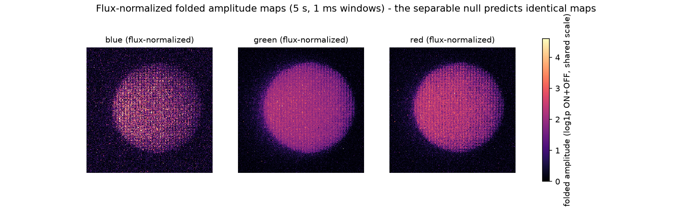
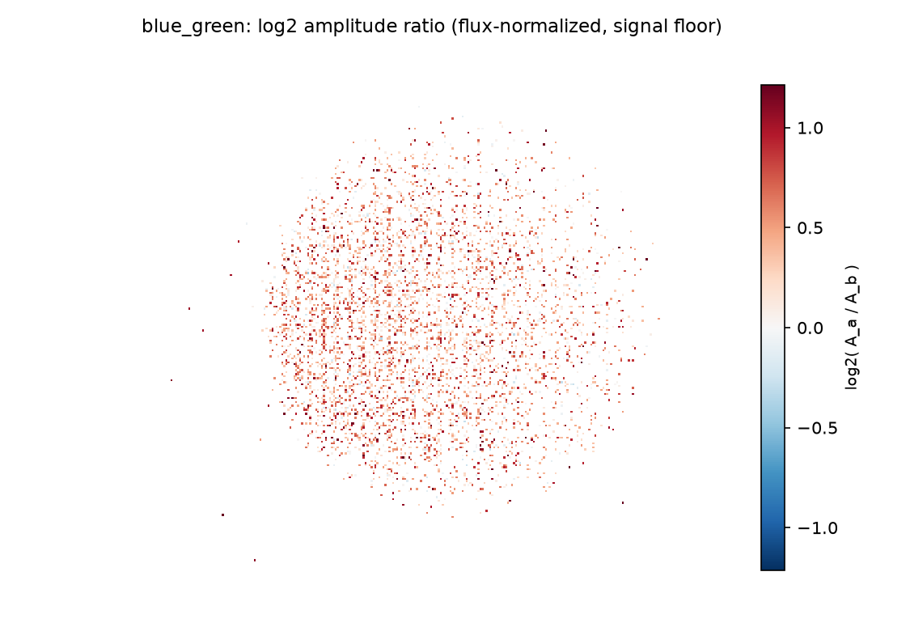
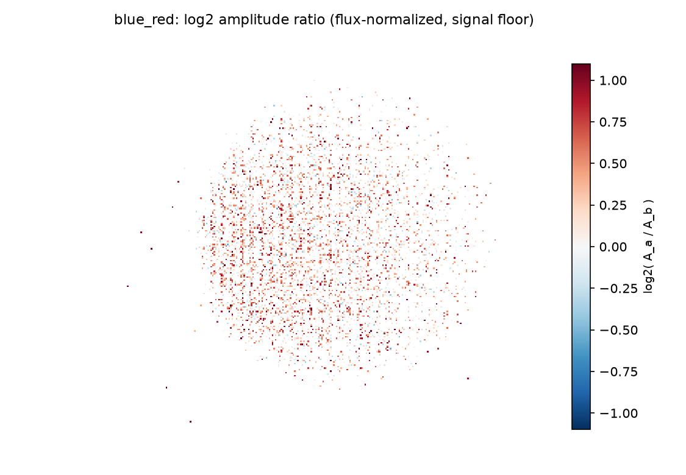
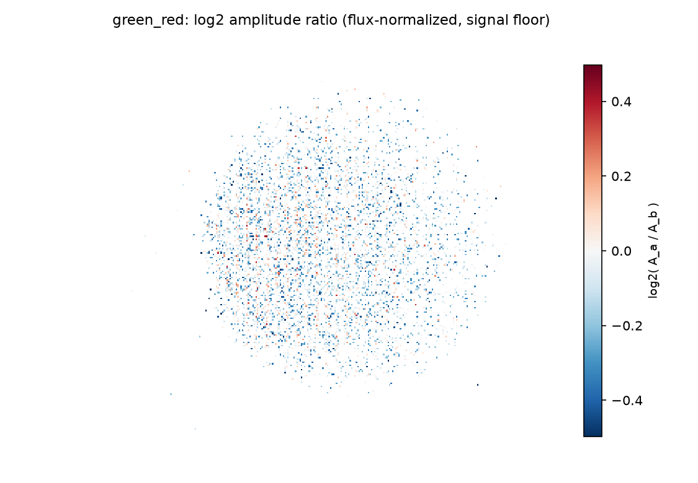
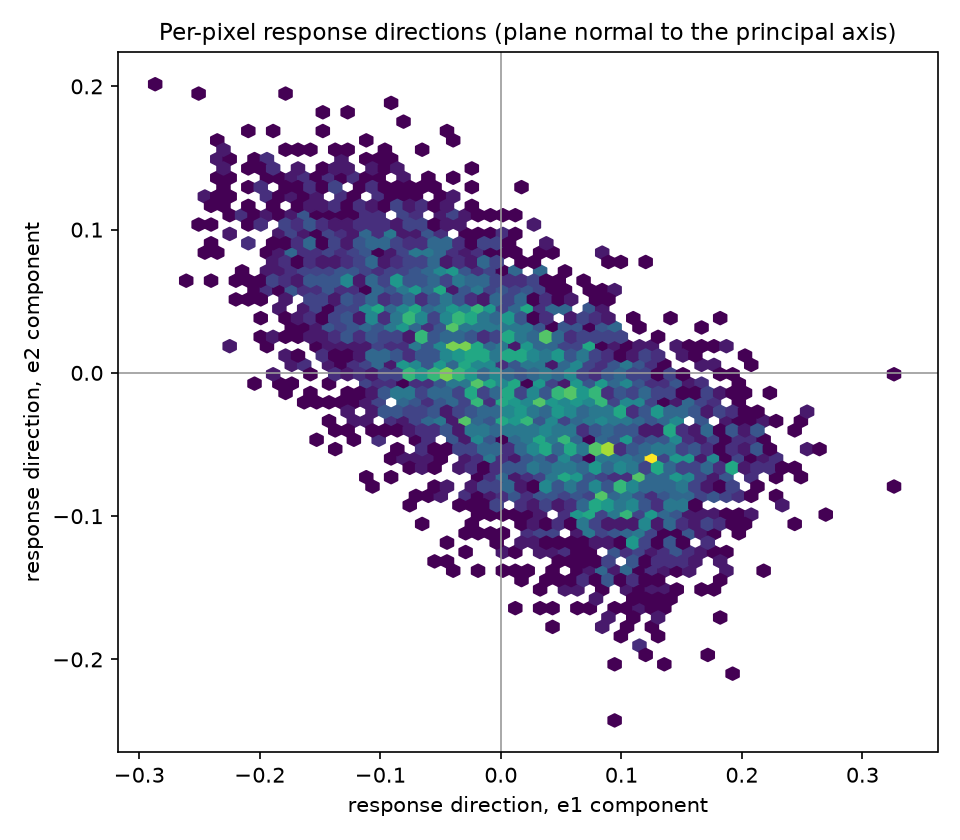
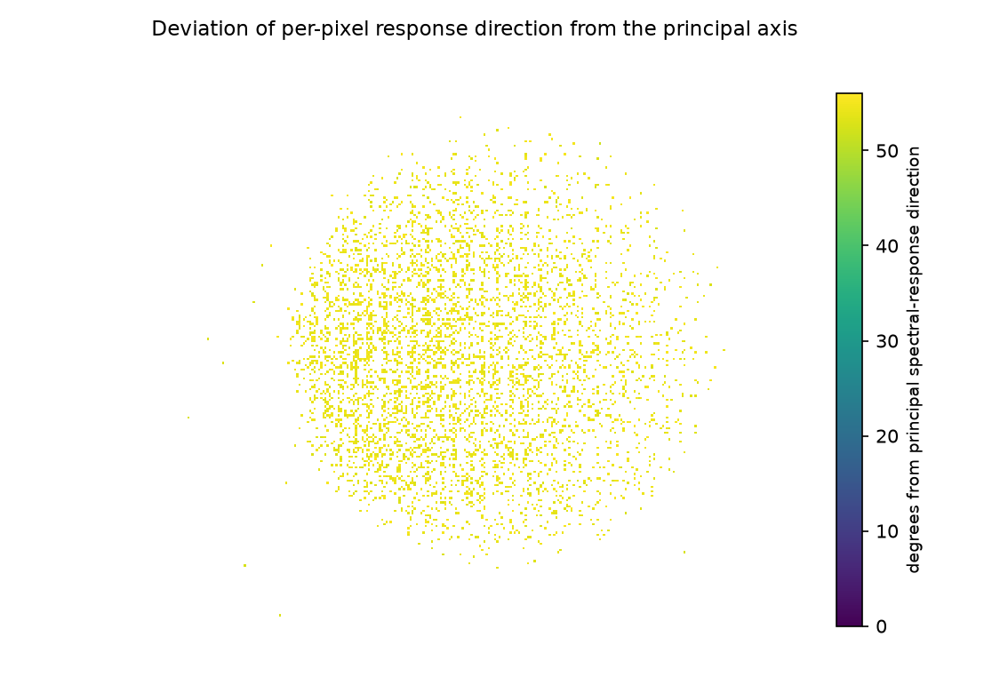
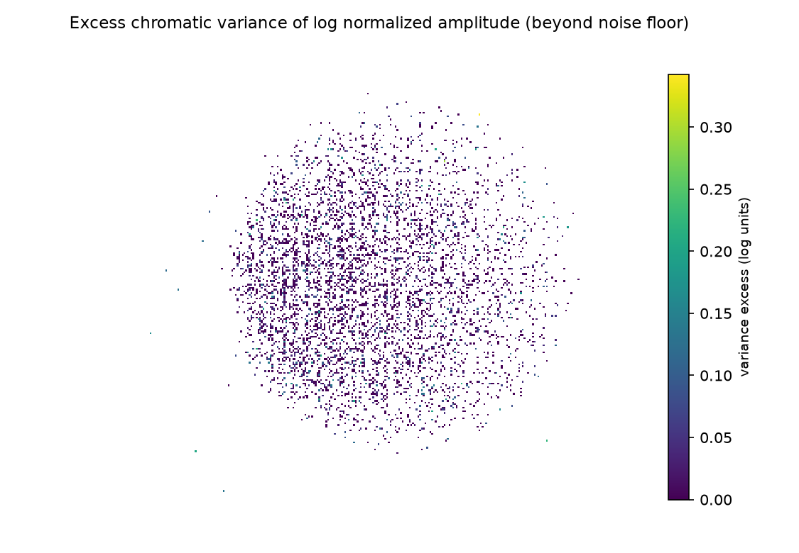

# Amplitude-encoding analysis — does the phase DOE redistribute amplitude spectrally?

**Date:** 2026-10-01
**Data:** `data/raw/evt3_raw/circle_blue|green|red.raw` (5 s each, same recordings as the
source-identification report) + `baseline.raw` dark control. No new recordings. Analysis:
`hypercam-amplitude` (`src/hypercam/analysis/amplitude_encoding.py`); results in
`results/amplitude_encoding/`. Companion to
`source_identification_report_2026-10-01.md`, which established that the signed
(ON−OFF) *shape* channel is wavelength-independent to within ~10%.

---

## 1. The question, and why this representation answers it

The DOE is inverse-designed to maximize wavelength Fisher information aggregated over
the sensor, with no spatial-discrimination constraint — "spectra without concern for
space." The event-rate model (Λ = C·|∂ln I/∂t| + Λ₀) says wavelength enters through the
**per-pixel modulation depth**, so the Fisher-carrying observable is the **folded
(ON+OFF) amplitude map**, not the signed shape the previous reports examined.

The physical constraint your observation supplies is what makes this test
interpretable: with a pure phase mask (one substrate, one photoresist, no absorbing
structure), cross-band amplitude differences **cannot be material attenuation** — they
can only be **diffraction-efficiency redistribution by interference**, the k(λ) morph
trajectory of the same phase map. The separable null model is

```
A_λ(u,v) = S(u,v) · c_λ      (bright spatial pattern × per-band scalar)
```

Under the null, **flux normalization removes everything**: normalized maps are
identical across bands, SSIM = 1, response directions are parallel, excess chromatic
variance = 0. Every deviation measured below is spatial chromatic structure — i.e.,
the phase depth doing spectral work at those pixels.

---

## 2. Findings

### F1 — The amplitude channel carries a real, ordered chromatic component

SSIM between flux-normalized amplitude maps (converged 5 s, 1 ms windows, signal area):

| pair | SSIM | luminance | **contrast** | structure | half-cross floor |
|---|---|---|---|---|---|
| blue–green | 0.771 | 0.934 | **0.898** | 0.921 | 0.709 |
| blue–red | 0.799 | 0.946 | **0.936** | 0.902 | 0.733 |
| green–red | 0.843 | 0.978 | **0.974** | 0.884 | 0.773 |

The **structure component is ≈ 0.9–0.92** — the shapes agree, consistent with the shape
report — while the **contrast component is the deficit** that orders by wavelength
distance: green–red (85 nm apart) > blue–red (135 nm) > blue–green (170 nm). Pearson
was blind to exactly this. SSIM exceeds the half-cross noise floor by ~0.06–0.08
everywhere (the floor itself is depressed by the in-place-varying component; SSIM is
also attenuated by noise).



### F2 — The gain-ratio maps: median offsets are physically sensible; fine structure is at the noise floor

log2 amplitude ratios over the 4,586-pixel signal area:

| pair | median | robust range |
|---|---|---|
| blue–green | **+0.425** | 1.212 |
| blue–red | **+0.303** | 1.096 |
| green–red | **−0.123** | 0.497 |

Medians are inconsistent with pure display-brightness scaling (which flux
normalization already removed) — but note the ordering: blue carries ~1.3–1.5× the
*per-flux* amplitude of green and red. Candidate explanations, in order of plausibility:
(a) the sensor's quantum efficiency / temporal-contrast response differs per band
outside the DOE; (b) genuine DOE redistribution. The **fine structure within each map
(±0.5–1.2 log2 units) does not exceed the half-to-half noise scale** (excess = 0.020
vs floor 0.040) — the per-pixel ratios are noise-dominated, so the *spatial pattern* of
the redistribution is not resolved by 5 s averages.





### F3 — Response directions are nearly parallel: the encoding is predominantly brightness-separable

At each signal pixel the triplet (A_blue, A_green, A_red)/|·| defines a response
direction. Weighted resultant length **0.9924** (1 = all parallel = separable);
eigenvalues **0.985 / 0.013 / 0.002** — a rank-1 cloud to within 1.5%; mean deviation
from the principal axis **6.1°** (random-direction baseline ≈ 20°, parallel = 0°).
So: **the three primaries produce nearly proportional amplitude maps** — the dominant
encoding mode is the per-band scalar (brightness coding), with a small but real
chromatic spread (6° ≪ 20°).




The deviation map shows the 6° spread is **spatially unstructured** (uniform noise
texture, no ring/lobe/geometry) — consistent with per-pixel noise, not a coherent
redistribution pattern.

### F4 — Excess chromatic variance: a systematic component at the noise scale

Excess = cross-band log-amplitude variance minus the within-band half-to-half noise
floor: **0.020 vs floor 0.040** (log units, per pixel). Positive but below the noise —
the systematic chromatic per-pixel variance is real (it survives averaging in the mean)
but small; its map shows no coherent geometry.



### F5 — Dark control: amplitude maps are scene-driven

Normalized-amplitude SSIM of the dark control vs the color maps: 0.36 / 0.25 / 0.32 —
weak overlap, as expected for a Λ₀-dominated noise map vs scene-driven amplitude.

### F6 — Flux scalars (raw per-primary yield, pre-normalization)

blue 1.00×, green 2.83×, red 2.21× (relative folded amplitude) — the sensor is far more
responsive to green/red swing than blue at these display levels. This scalar is
display+sensor, not DOE; it is removed by normalization but recorded for completeness.

---

## 3. Interpretation

Combining with the shape-channel findings (source-identification report):

1. **The dominant encoding mode realized in these recordings is brightness-separable**:
   a shared spatial pattern S(u,v) times a per-band scalar. Resultant length 0.992 and
   rank-1 eigenstructure say the pixel responses are nearly parallel.
2. **The chromatic residue is real but small and spatially unstructured**: median
   gain offsets of ±0.1–0.4 log2 units that order by wavelength distance (SSIM
   contrast, gain medians), a 6° direction spread, and excess variance ½ the noise
   floor — all consistent, all below/at the per-pixel noise scale, none showing DOE-like
   geometry (no rings/lobes; the deviation and excess maps are noise-textured).
3. **Therefore**: either the DOE's spectral encoding operates through channels these
   three broadband primaries cannot excite measurably (narrow-band redistributed orders
   buried under the direct image), or the realized operating point sits near the
   direct-image (zero-order) regime where the phase depth does little work — the m =
   1 magnification result supports the latter. Attribution of the *median* gain offsets
   (DOE vs sensor QE vs display subpixel mosaic) needs a no-DOE reference that does not
   exist in the data.

## 4. Impact on prior claims

- The amplitude channel — the one Pearson-based analyses could not see — **does**
  contain wavelength-ordered differences (SSIM contrast deficit ordering by band
  separation). The earlier statement "wavelength-dependent differences are confined to
  the unmeasured amplitude channel" is now partially measured: they are present at
  median ±0.1–0.4 log2 / 6° spread, spatially unstructured.
- "Spectral encoding not present in shape data" stands; "present in amplitude data" is
  now: **only as a separable scalar + sub-noise unstructured residue** — not as a
  resolvable spatial-spectral code at these three broadband primaries and this
  operating point.

## 5. Next experiments (unchanged priorities, one added)

1. **Narrow-band illumination** (laser/LED lines across λ): the decisive test of the
   morph trajectory — a phase DOE's redistribution grows with coherent/narrow-band
   drive, while broadband display primaries average it away. Existing
   `spectral_*.raw`/`gaussian_*.raw` sets may partially serve this and are the obvious
   next analysis target with this new module.
2. No-DOE reference recording (separates DOE gain from sensor/display structure).
3. Direct-image reference through the optics (the still-pending branch).
4. Same-color repeats / 60 Hz-incommensurate drive (unchanged from the shape report).

## 6. Artifact inventory (`results/amplitude_encoding/`)

`analysis_metadata.json`; `conclusions.json/.md`; `ssim.csv` +
`ssim_maps/<pair>.{png,npy}`; `gain_maps/<pair>.{png,npy}` (log2 ratios);
`separability.json`; `normalized_sheet_5s.png`; `deviation_angle_map.png`;
`excess_variance_map.png`; `direction_scatter.png`;
`amplitude_frames/<label>_{activity,normalized}_5s.{npy,png}`.

### Reproduce

```bash
uv run hypercam-amplitude \
    --pattern 'data/raw/evt3_raw/circle_*.raw' \
    --control-pattern 'data/raw/evt3_raw/baseline.raw' \
    --output results/amplitude_encoding
```