# Source identification report — what the converged cross-band correlation measures

**Date:** 2026-10-01
**Data:** `data/raw/evt3_raw/circle_blue|green|red.raw` (720 × 1280 EVT3, 5 s each) and
`data/raw/evt3_raw/baseline.raw` (5.7 s dark control). No new recordings; analysis by
`hypercam-source` (`src/hypercam/analysis/source_identification.py`), results in
`results/source_identification/`.

---

## 1. Executive summary

The duration sweeps showed the cross-band Pearson r of the signed (ON − OFF) activity
frames rising monotonically with total averaging time T toward r ≈ 0.78–0.90 at 5 s.
This report answers the question that rise demands: **what is the repeatable component
that r converges to?**

**Answer: a wavelength-independent, pixel-registered, scene-driven structure — the
direct display-image geometry and its texture, plus a slowly varying shared component
that averaging suppresses. It is not the spectral encoding.**

Supporting findings, each with its measurement below:

1. The corrected split-half reliability shows a 0.5 s average is **not self-reproducible
   at all** (r ≈ −0.04); reproducibility is built over seconds (0.26 → 0.62 → 0.82 at
   1 / 2.5 / 5 s). Cross-band r tracks this ceiling almost exactly (fraction of ceiling
   ≈ 1).
2. Disattenuated cross-band correlations are r_true = 0.89 / 0.95 / 1.00 — the
   repeatable *shapes* are nearly identical across colors. Any color-specific shape
   component is ≤ ~11% of variance, and it does not order by wavelength distance.
3. The no-high-pass Sobel congruence maps show **no incongruous regions anywhere**;
   bands agree everywhere (0.6–1.0), most strongly inside the displayed disk.
4. The magnification sweep peaks sharply at **m = 1.00** for every pair and is ≈ 0 at
   the λ-ratio magnifications where a diffractively scaled encoding would appear
   (m ≈ 0.75 for blue-vs-red). The shared fine structure does **not** scale with
   wavelength.
5. The dark control does **not** overlap the repeatable component (map r 0.05–0.08) —
   it is not the dark-noise asymmetry map.
6. Early-vs-late segments of the same recording correlate only 0.17–0.36, and a shift
   search restores nothing (optimum at zero shift): the pattern decorrelates **in
   place** — slow settling/drift, not mechanical motion — and early and late segments
   are equally similar across bands, so the r(T) rise is **not** transient dilution.

**Bottom line:** to the extent wavelength-dependent differences exist, they are confined
to ≤ ~10% of the shape variance (attribution unknown) and/or the unmeasured amplitude
(gain) channel. The dominant, reproducible shape data is wavelength-independent, and
convergence statistics built on it (including the earlier "80% separation target
reached" claim) measure shared scene/instrument structure, not spectral separation.

---

## 2. Method

### 2.1 Measurement model

Each 1 ms accumulation window is one threshold-quantized signed sample of the pixel's
log-intensity change (Shah et al., CVPR 2024, Supplement S4, Lemma S4.1):
`Σᵢ pᵢ = Δlog I / T ± ε`, |ε| < 1. The signed estimator (`--polarity signed`) is the
paper's binned event frame.

### 2.2 Corrected split-half reliability (fixes the fraction_of_ceiling diagnostic)

`duration_sweep` deals windows *interleaved* (`index % splits`), handing every
replicate a fixed phase offset of the display-periodic (60 Hz) modulation. Under signed
polarity those offsets are systematic, so replicate differences are dominated by phase,
and the split-half reliability collapses to negative values (visible in
`results/spectral_correlation_fine_signed/duration_accumulation_sweep.csv`). The
corrected diagnostic splits each recording into **disjoint contiguous time blocks**
(here: halves of the truncated span at each duration), correlates the blocks through
the identical pipeline (crop, 64 px high-pass, support mask), and applies the
Spearman–Brown correction to the full-length estimate. Because each block spans many
complete display periods, phase sampling is unbiased.

### 2.3 Disattenuation

Independent noise biases an observed correlation toward zero by the product of the
reliabilities (Spearman 1904): `r_true ≈ r_obs / sqrt(rel_a · rel_b)`. This is the
number that distinguishes "the spectra encode similar shapes" from "a shared
non-spectral map dominates". Reliability estimates are themselves noisy; r_true can
clip at 1 and should be read with that caveat.

### 2.4 Gradient congruence without the high-pass

Signed Sobel components (Sx, Sy) of the cropped, **unfiltered** frames, correlated
across bands globally and in 64 px windows, masked on the **intersection** of the two
intensity supports (the gradient of an unmeasured pixel is undefined, not zero — union
masking would correlate structure against support-edge artifacts). Pearson and the
gradient field are both invariant to gain and offset, so amplitude-channel differences
are invisible to this statistic by construction.

### 2.5 Segment stationarity + shift search

First and last 0.5 s of each recording, correlated within and across bands; a ±12 px
integer shift search then distinguishes mechanical drift (correlation restored at a
nonzero shift) from in-place decorrelation.

### 2.6 λ-scaling magnification sweep

A DOE far-field pattern scales radially with wavelength. Band A's 400×400 tile around
the disk centroid is fixed; band B's central (400/m)-pixel region is zoomed back to
400×400 for m ∈ [0.6, 1.4] (step 0.02) and compared via gradient congruence and
high-passed intensity r. A diffractive encoding peaks at m ≈ λ_a/λ_b; a direct image
peaks at m = 1.

### 2.7 Dark control

`baseline.raw` is a 5.7 s dark recording (41,864 events ≈ 7.3 ev/s across the full
sensor, vs ~10⁶ ev/s for the circles) with a strongly OFF-skewed signed map (35,183
negative vs 4,518 positive pixels). Structure that repeats there is sensor-fixed by
construction.

### Reproduce

```bash
uv run hypercam-source \
    --pattern 'data/raw/evt3_raw/circle_*.raw' \
    --control-pattern 'data/raw/evt3_raw/baseline.raw' \
    --output results/source_identification
```

---

## 3. Data inventory

| recording | role | events | duration | notes |
|---|---|---|---|---|
| circle_blue / green / red | bands under test | 5.3 M / 7.6 M / 7.2 M | 5.0 s each | 513k–740k active pixels; signed maps strongly OFF-skewed (e.g. blue: 55.7k positive vs 457.8k negative pixels) |
| baseline | dark control | 41,864 | 5.7 s | ~7.3 ev/s, spatially uniform; control self-reliability 0.043 (too sparse to reproduce itself) |

Frames on a shared signed scale — the disk is **net-negative** for all three bands:

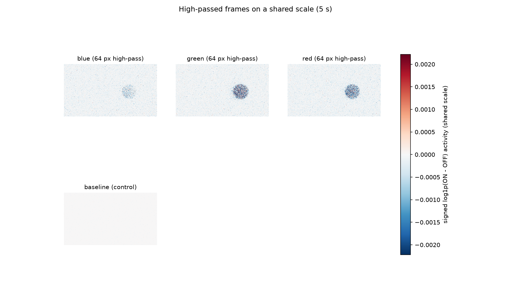

Full-duration activity frames (signed log1p, shared scale):

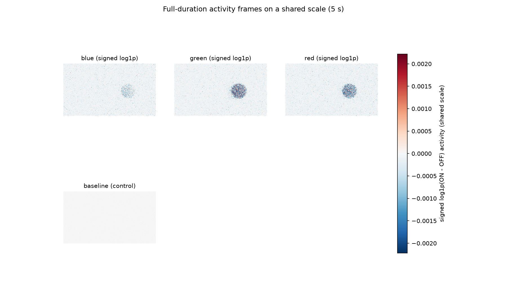

Dark control (signed log1p):

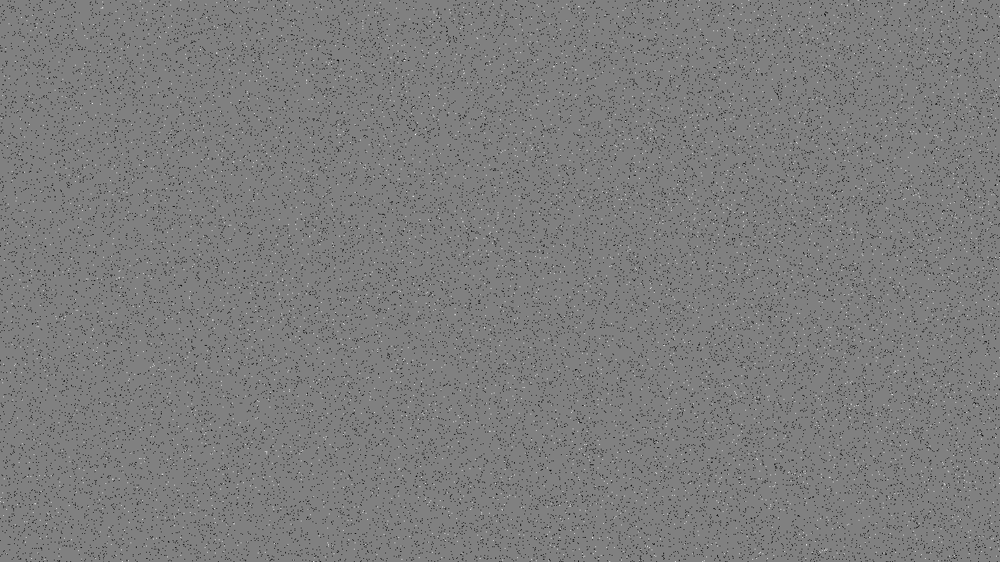

---

## 4. Findings

### F1 — Reproducibility is built over seconds, and cross-band r tracks it

| T (s) | mean cross r | ceiling (disjoint halves) | fraction of ceiling |
|---|---|---|---|
| 0.5 | 0.158 | **−0.044** | n/a |
| 1 | 0.361 | 0.260 | 1.39 |
| 2.5 | 0.648 | 0.623 | 1.04 |
| 5 | 0.784 | 0.821 | 0.96 |

The old interleaved diagnostic reported negative garbage here; the corrected one shows
the cross-band correlation **equals the within-recording reliability** wherever the
latter is defined. There is no separate "spectral" component that r reveals beyond
what a recording can reproduce of itself.

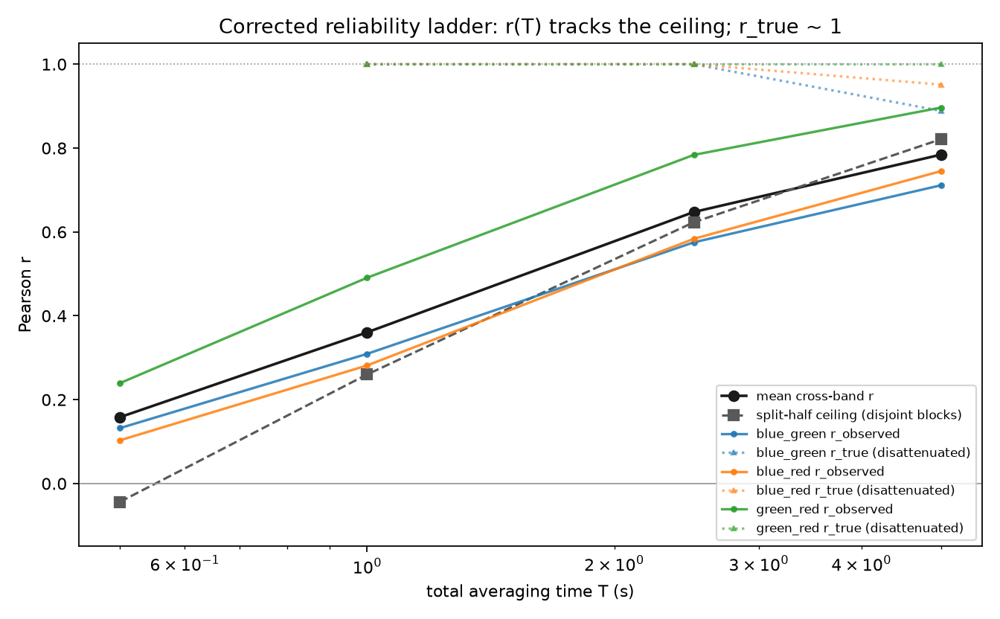

For context, the prior signed sweep (interleaved diagnostic, same recordings):
`results/spectral_correlation_fine_signed/discernibility_curves.png`
(copied as `figures/source_identification/prior_context_signed_discernibility.png`).

### F2 — Disattenuated cross-band correlations: the shapes are ~identical

| pair | r_obs(5 s) | rel_a | rel_b | attenuation ceiling | r_true | shape variance that differs |
|---|---|---|---|---|---|---|
| blue–green | 0.711 | 0.719 | 0.891 | 0.800 | 0.889 | ≤ 11% |
| blue–red | 0.745 | 0.719 | 0.854 | 0.783 | 0.951 | ≤ 5% |
| green–red | 0.897 | 0.891 | 0.854 | 0.872 | 1.000 (clipped) | ≈ 0% |

The residual does not order by wavelength distance (blue–green, the closest pair, is
the *least* similar) — arguing against a clean spectral origin for the remainder.

### F3 — Congruence maps: no incongruous structure anywhere

Signed-gradient congruence in 64 px windows, no high-pass:

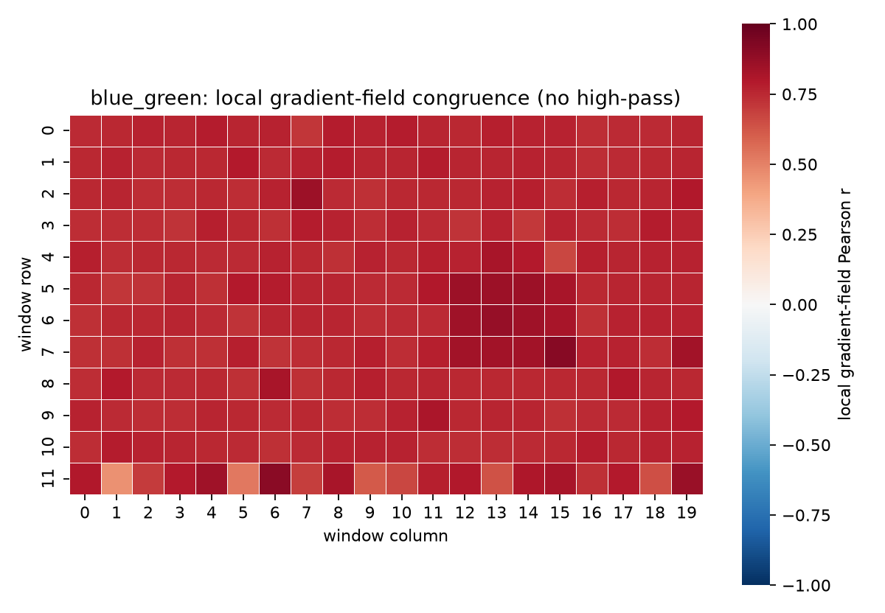
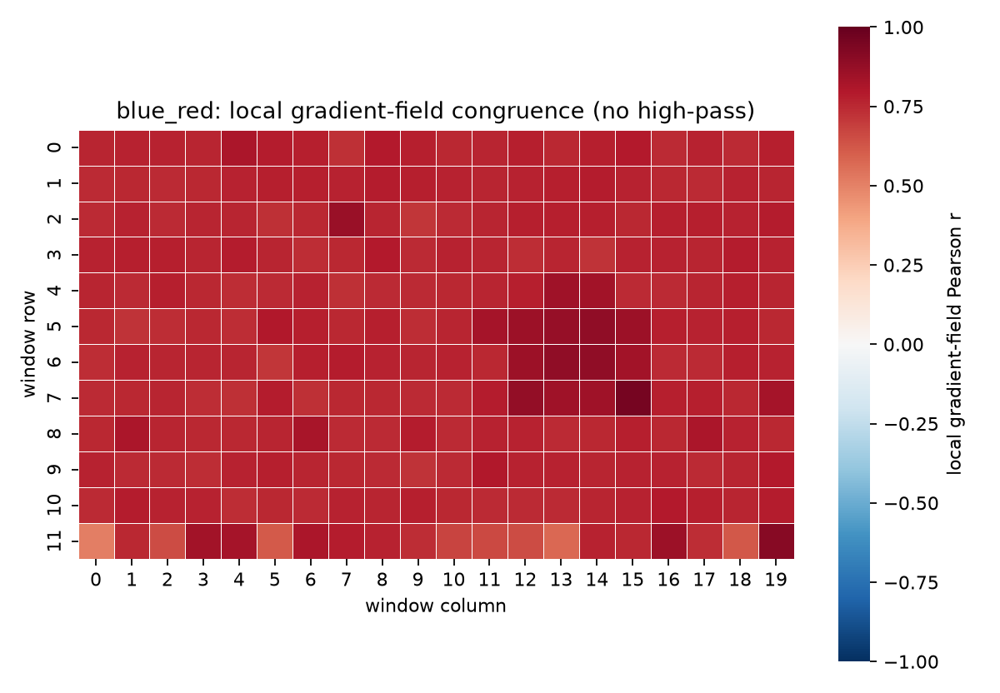
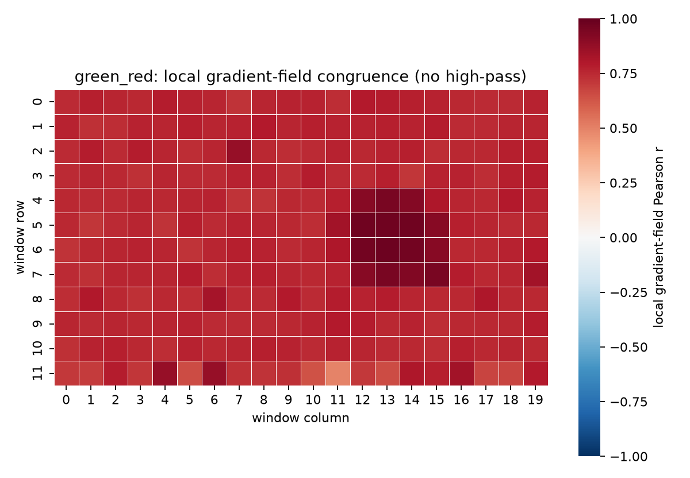

Global / half-cross statistics: 0.75/0.69 ± 0.01 (blue–green), 0.78/0.70 ± 0.00
(blue–red), 0.93/0.89 ± 0.00 (green–red). Agreement is everywhere; strongest inside the
disk; the bottom crop edge shows support-edge degradation (seen and documented in the
unit tests). Repeatable *incongruous* structure — the signature a spectral encoding
would need — is absent at this scale.

### F4 — Magnification sweep: the shared texture does not scale with wavelength

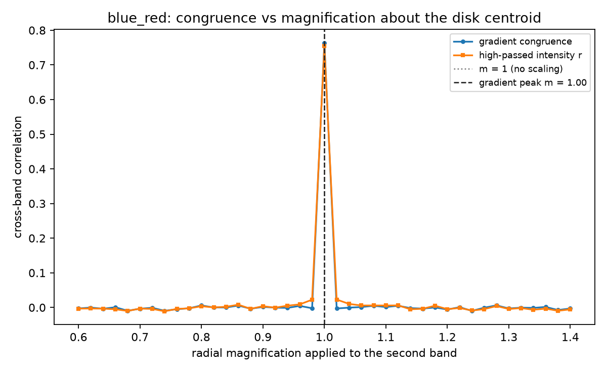
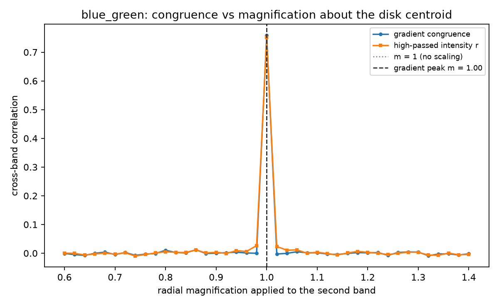
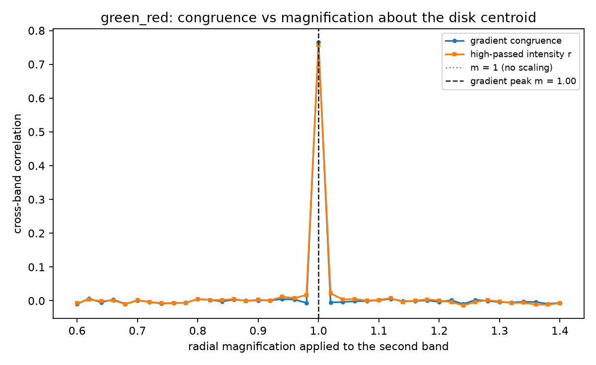

All pairs peak sharply at m = 1.00 (gradient 0.76–0.77; intensity 0.76–0.93) and fall
to ≈ 0 within ±2% scaling. The λ-ratio magnifications (≈ 0.75 for blue-vs-red, ≈ 0.87
for green-vs-red) hold **zero** congruence. Whatever the shared fine structure is, it
is wavelength-independent: a direct image of the display content, not a λ-scaled
diffraction pattern.

### F5 — The pattern is not stationary, and it does not move

Early vs late 0.5 s segments (first/last 500 windows), shared scale:

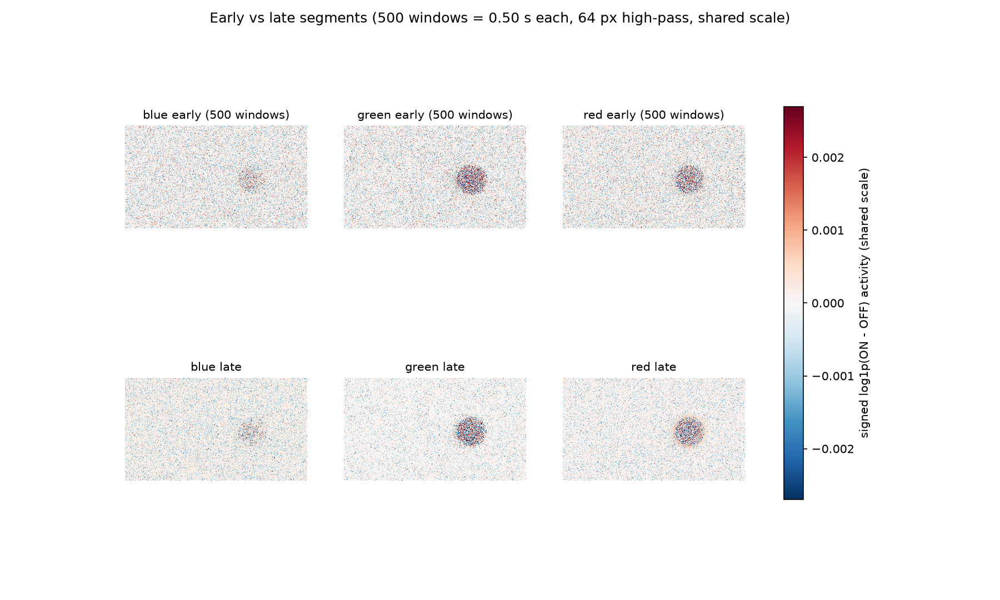

| comparison | r |
|---|---|
| blue early vs late | 0.169 |
| green early vs late | 0.358 |
| red early vs late | 0.287 |
| blue–green early-early / late-late / early-late | 0.233 / 0.204 / 0.202 |
| blue–red early-early / late-late / early-late | 0.224 / 0.203 / 0.203 |
| green–red early-early / late-late / early-late | 0.322 / 0.342 / 0.317 |

The ±12 px shift search restores nothing: every optimum is at exactly zero shift. So
the texture decorrelates **in place** over seconds — slow sensor-state/display
settling, not mechanical sliding. Early and late segments are equally similar across
bands, ruling out dilution of a band-specific switch-on transient as the cause of the
r(T) rise. The rise is the progressive averaging-down of an in-place-varying shared
component.

### F6 — Dark control: the repeatable component needs the scene

Control self-reliability 0.043; overlap with the color recordings' repeatable maps
0.054–0.079 (gradient 0.080–0.119) — indistinguishable from zero. The repeatable
component is scene-driven, not the dark-noise asymmetry map.

### F7 — Where wavelength-dependent differences could still hide

1. The small blue-involving shape residual (≤ 11%, ≤ 5%) — real but unattributed
   (encoding, band-dependent scene coupling, or disattenuation error).
2. The amplitude/gain channel — completely unmeasured; Pearson and the gradient field
   are blind to it by construction. Measuring it needs regression gains normalized by
   a per-color brightness reference, which no existing recording provides.
3. Wavelength structure finer than the three LCD primaries — out of scope of this data.

---

## 5. Interpretation — what causes the high r(T→∞)

Putting F1–F6 together: the converged correlation is the cross-band agreement of

- the **direct display-image structure** (the disk geometry and its texture —
  wavelength-independent, pixel-registered, present only when the scene is on), plus
- a **slowly varying shared component** (in-place decorrelating over seconds — sensor
  state / display settling), which short averages cannot suppress and long averages
  dilute.

The monotone r(T) rise is therefore neither noise attenuation of a fixed encoding nor
the spectra converging: it is the averaging-down of a nonstationary, band-independent
scene/instrument component. The spectral encoding, if present in these recordings at
all, is confined to the small shape residual and/or the amplitude channel.

## 6. Impact on prior claims

- **"80% cross-color separation target reached"** — re-read: the converged 0.78–0.90
  measures shared scene/instrument structure, not spectral separation.
- **"Signed polarity strengthens the signal (0.61 → 0.78)"** — still valid as an
  estimator statement (folding was an artifact), but the strengthened signal is the
  shared non-spectral component.
- **"16 ms = one display period is the detectability edge"** — unchanged; the segment
  diagnostics reinforce that display-driven temporal structure dominates.

## 7. Pending branches and next experiments

- Present-in-direct-display-image branch: needs a linear-camera capture of the display
  through the same optics (does not exist in the repository; `results/rgb_raw` is event
  data of the same recordings).
- Amplitude-channel test: regression gains between bands normalized by per-color
  display brightness (needs the linear reference above, or a spectrometer measurement
  of the display's three primaries).
- Same-color repeat recordings: within-band reproducibility ceiling without the
  confound of comparing different colors.
- A drive incommensurate with 60 Hz: separates display-refresh phase-locking from
  genuine scene structure.
- Settling characterization: pre-roll before/after color switches to time the
  in-place-varying component.

## 8. Artifact inventory (`results/source_identification/`)

`analysis_metadata.json` (full recipe + provenance); `correlation_full.csv/.npy/.svg`;
`reliability.csv` (corrected ladder); `gradient_congruence.csv`;
`gradient_congruence_maps/<pair>.{png,npy}`; `segments.csv`;
`magnification_sweep.csv` + `magnification_sweep_<pair>.png`; `conclusions.json/.md`;
`reliability_ladder.{png,svg}`; `frames/` — per-duration activity/processed frames
(.npy + .png), shared-scale sheets (`activity_sheet_5s.png`, `processed_sheet_5s.png`,
`segments_sheet_5s.png`), per-color early/late segment frames, and the dark-control
frames.